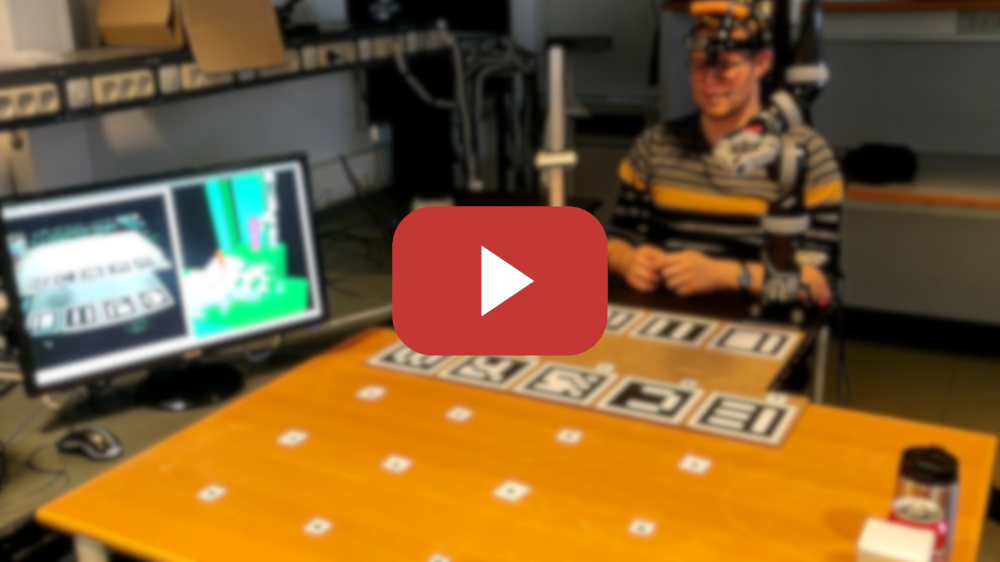

## Eye Controlled Semi-autonomous Assistive Manipulator (ECSAM)
  

This repository contains the code for the *ECSAM*, which is a proof of concept of an assistive robotic system controlled by gaze. It is developed by Robotics group 19gr668 at Aalborg University for their Bachelor's thesis in spring 2019.

The *ECSAM* comprises of the *Kinova JACO* assistive robotic manipulator, *EYE-TRAC™7* gaze tracker and a *Intel®RealSense™D435i* depth sensing camera. It is designed for highly disabled people to provide high level autonomous functionalities, which are activated by a blinking pattern, without a need of an additional display. The *ECSAM* allows a user to directly interact with objects in the scene by correlating their gaze to a selected object, which is subsequently grasped and manoeuvred autonomously. In order to place the grasped object, a user can similarly select a position on a horizontal surface, on which the object is placed. 

> **Note: The code comes "as is" and the 19gr668 group is not responsible for any possible harm to the surroundings or the system itself caused by running this program.**

[](http://www.youtube.com/watch?v=ABm_0BWKxWs "ECSAM")


### Launching of the *ECSAM*

#### Virtual *JACO*
###### Terminal1:
```sh
$ roslaunch j2n6s200 moveit_virtual.launch
```
OR
```sh
$ roslaunch j2n6s200 moveit_gazebo.launch
```
###### Terminal2:
```sh
$ roslaunch ecsam virtual_gazebo.launch
```


#### Physical *JACO*
###### Terminal1:
```sh
$ roslaunch j2n6s200 moveit_connected.launch
```
###### Terminal2:
```sh
$ roslaunch ecsam connected.launch
```


## Installation

### Additional dependencies

Please, follow these instructions prior to compilation of this stack:

##### JACO

###### Kinova
```sh
$ mkdir kinova-ros_ws
$ cd kinova-ros_ws
$ mkdir src
$ cd src
$ git clone https://github.com/Kinovarobotics/kinova-ros.git kinova-ros
$ cd ..
$ catkin_make -DCMAKE_BUILD_TYPE=Release
$ sudo cp src/kinova-ros/kinova_driver/udev/10-kinova-arm.rules /etc/udev/rules.d/
$ echo "source $PWD/devel/setup.bash --extend" >> ~/.bashrc
```

###### MoveIt!
```sh
$ sudo apt-get install ros-kinetic-moveit ros-kinetic-trac-ik
```

###### Gazebo (optional)
```sh
$ sudo apt-get install ros-kinetic-gazebo-ros* ros-kinetic-gazebo-ros-control ros-kinetic-ros-controllers*
$ sudo apt-get install ros-kinetic-timed-roslaunch
```

##### D435i

###### librealsense2

```sh
$ sudo apt-key adv --keyserver keys.gnupg.net --recv-key C8B3A55A6F3EFCDE || sudo apt-key adv --keyserver hkp://keyserver.ubuntu.com:80 --recv-key C8B3A55A6F3EFCDE
$ sudo add-apt-repository "deb http://realsense-hw-public.s3.amazonaws.com/Debian/apt-repo xenial main" -u
$ version="2.19.2-0~realsense0.807"
$ sudo apt-get install librealsense2-dkms librealsense2=${version} librealsense2-utils=${version} librealsense2-dev=${version} librealsense2-dbg=${version}
```

###### realsense2_camera

```sh
$ mkdir realsense-2.2.3-ros_ws
$ cd realsense-2.2.3-ros_ws
$ mkdir src
$ cd src
```
- Download compatible realsense2_camera pkg (such as 2.2.3) from [here](https://github.com/intel-ros/realsense/releases) and place its contents inside this directory.

```sh
$ cd ..
$ catkin_make clean
$ catkin_make -DCATKIN_ENABLE_TESTING=False -DCMAKE_BUILD_TYPE=Release
$ catkin_make install
$ echo "source $PWD/devel/setup.bash --extend" >> ~/.bashrc
```

```sh
$ sudo apt-get install ros-kinetic-rgbd-launch
```

##### aruco_mapping
```sh
$ sudo apt-get install ros-kinetic-aruco*

$ mkdir aruco_mapping-ros_ws
$ cd aruco_mapping-ros_ws
$ mkdir src
$ cd src
$ git clone https://github.com/SmartRoboticSystems/aruco_mapping.git aruco_mapping
$ cd ..
$ catkin_make -DCMAKE_BUILD_TYPE=Release
$ echo "source $PWD/devel/setup.bash --extend" >> ~/.bashrc
```

##### Grasp Pose Detection (gpd)

```sh
$ sudo add-apt-repository ppa:v-launchpad-jochen-sprickerhof-de/pcl
$ sudo apt-get update
$ sudo apt install libpcl-dev libeigen3-dev libprotobuf-dev libleveldb-dev libsnappy-dev libopencv-dev libhdf5-serial-dev protobuf-compiler liblmdb-dev libatlas-base-dev libopenblas-* libgoogle-glog-dev
$ sudo apt-get install --no-install-recommends libboost-all-dev
$ git clone https://github.com/BVLC/caffe.git caffe
$ cd caffe
$ mkdir build
$ cd build
$ cmake ..
$ make all
$ make install
$ make runtest
$ cd ..
$ protoc src/caffe/proto/caffe.proto --cpp_out=.
$ mkdir include/caffe/proto
$ mv src/caffe/proto/caffe.pb.h include/caffe/proto
```

```sh
$ mkdir gpd-ros_ws
$ cd gpd-ros_ws
$ mkdir src
$ cd src
$ git clone https://github.com/atenpas/gpg.git gpg
$ git clone https://github.com/atenpas/gpd.git gpd
$ cd gpg
$ mkdir build
$ cd build
$ cmake ..
$ make
$ sudo make install
$ cd ../..
$ catkin_make -DCMAKE_BUILD_TYPE=Release
$ echo "source $PWD/devel/setup.bash --extend" >> ~/.bashrc
```

##### Interface sound
```sh
$ sudo apt-get install ros-kinetic-sound-play
```

### Compilation of the *ECSAM*
```sh
$ git clone https://github.com/AleksandraZasadni/19gr668_ECSAM 19gr668_ECSAM 
$ cd 19gr668_ECSAM 
$ catkin_make -DCMAKE_BUILD_TYPE=Release
$ echo "source $PWD/devel/setup.bash --extend" >> ~/.bashrc
```
